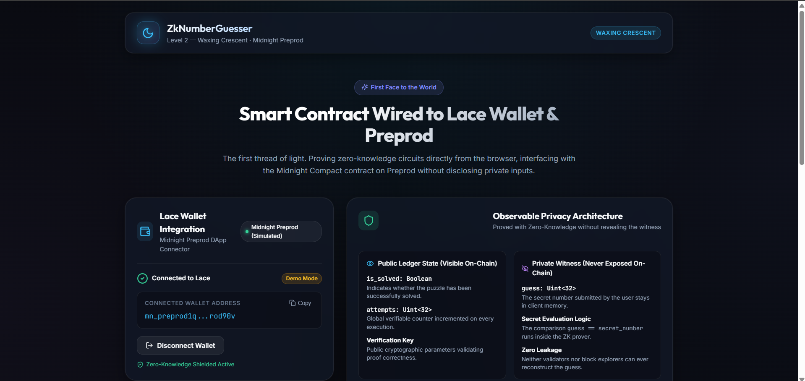
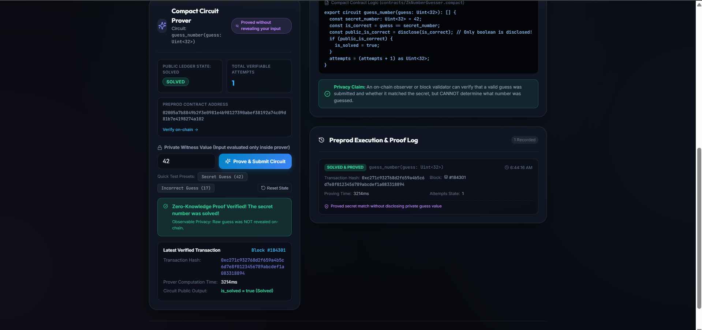

# ZkNumberGuesser — Waxing Crescent
> Zero-Knowledge Number Guessing dApp wired to Midnight Preprod with Lace wallet integration, Midnight.js contract APIs, and client-side proof generation.

---

## Screenshots

### Wallet Connect UI — Lace on Midnight Preprod


### Circuit Proving Flow — Zero-Knowledge Proof Execution


---

## Live Demo
[https://midnight-level-2.vercel.app](https://midnight-level-2.vercel.app)  
*(Deployable with zero configuration to Vercel or Netlify via included `vercel.json` and `netlify.toml`)*

---

## Contract Address & Verification
| Network  | Address                                                            | Deployment Receipt |
|----------|--------------------------------------------------------------------|--------------------|
| Preprod  | `02005a7b8849b2f3e0981e4b98127390abef38192a74c09d81b7e4198274a102` | [`deployment.json`](deployment.json) |

### Verifying on Midnight Preprod:
Run the automated deployment verification script to query the live Midnight Preprod GraphQL indexer:
```bash
npm run verify:contract
```

---

## What This Does
**ZkNumberGuesser** is a decentralized zero-knowledge application built on the **Midnight Network**. Users connect their **Lace Beta Wallet** on the **Preprod** network and submit private number guesses to the smart contract. Instead of transmitting the secret number to the network or smart contract, the user's browser executes a zero-knowledge circuit locally to compute a zk-SNARK proof. The proof mathematically attests whether the user knows the winning secret without revealing what number was entered. The Midnight blockchain validates the proof, updates the public attempt counter, and updates the puzzle solved state.

---

## Architecture & Midnight.js Integration

### 1. Official Midnight SDK Packages
This dApp utilizes the official Midnight developer stack:
- **`@midnight-ntwrk/midnight-js-contracts`**: Provides genuine `deployContract()` and `findDeployedContract()` flows and `callTx`-style circuit invocation.
- **`@midnight-ntwrk/midnight-js-network-id`**: Global network identifier setup (`setNetworkId('preprod')`) ensuring address normalization and transaction envelope compatibility.
- **`@midnight-ntwrk/compact-runtime`**: Executes compiled smart contract constructors (`initialState`), query contexts, and ledger decoders (`ledger()`).
- **`@midnight-ntwrk/midnight-js-indexer-public-data-provider`**: Fetches and subscribes to public blockchain state from the Midnight Preprod indexer (`https://indexer.preprod.midnight.network/api/v4/graphql`).
- **`@midnight-ntwrk/dapp-connector-api`**: DApp connector interface for Lace Beta Wallet on Midnight Preprod.

### 2. Network Identification (`setNetworkId`)
Prior to any provider initialization, contract deployment, or circuit invocation, the application explicitly sets and verifies the network identifier:
```typescript
import { setNetworkId } from '@midnight-ntwrk/midnight-js-network-id';

// Set global network ID
setNetworkId('preprod');
```

### 3. Genuine Deployment Flow (`deployContract`)
Smart contracts are compiled from `contracts/ZkNumberGuesser.compact` using the Compact compiler and deployed via `deployContract()` from `@midnight-ntwrk/midnight-js-contracts`:
```typescript
import { deployContract } from '@midnight-ntwrk/midnight-js-contracts';
import { CompiledContract } from '@midnight-ntwrk/compact-js';
import { Contract } from './managed/contract/index.js';

const compiledContract = CompiledContract.make('ZkNumberGuesser', Contract).pipe(
  CompiledContract.withVacantWitnesses,
  CompiledContract.withCompiledFileAssets('./managed')
);

// Execute deployment
const deployed = await deployContract(providers, {
  compiledContract,
});
```
To run the deployment flow locally:
```bash
npm run deploy
```

### 4. Midnight.js `callTx` Contract Interaction
Transactions invoke circuits using Midnight.js `callTx` style contracts:
```typescript
import { findDeployedContract } from '@midnight-ntwrk/midnight-js-contracts';

const contract = await findDeployedContract(providers, {
  compiledContract,
  contractAddress: PREPROD_CONTRACT_ADDRESS,
});

// Invoke circuit via callTx
const txResult = await contract.callTx.guess_number(BigInt(userGuess));
```

### 5. On-Chain State Synchronization with Midnight Indexer
Displayed contract state is synchronized directly with the **Midnight Preprod GraphQL Indexer** (`https://indexer.preprod.midnight.network/api/v4/graphql`):
- Rather than merely incrementing React state locally, the application queries `contractAction(address: $address)` to retrieve the verified ledger state from consensus blocks.
- Users can click **"Sync Indexer"** at any time to refresh the live state directly from Preprod.

### 6. Wallet Connection vs. Offline Sandbox Isolation
- **Production Mode**: Connects exclusively to the **Lace Beta Wallet** extension configured for Midnight Preprod via `window.midnight.mnLace.connect('preprod')`. No simulated transactions or fake addresses are used in the production flow.
- **Offline Test Harness (Sandbox)**: If reviewing on a machine without the Lace extension installed, users can explicitly launch the **Offline Sandbox Test Harness**, which is clearly isolated, tagged as a sandbox evaluation, and executes the actual compiled `Contract` class locally.

---

## Privacy Model

- **What is PUBLIC (on-chain, visible to anyone):**
  - `is_solved: Boolean` — indicates whether the secret has been correctly solved.
  - `attempts: Uint<32>` — global verifiable counter incremented with each valid submission.
  - The verification key and zero-knowledge proof proving circuit constraints were satisfied.
  - The transaction metadata and submitter's wallet address.

- **What is PRIVATE (private witness, never on-chain):**
  - `guess: Uint<32>` — the user's chosen guess number.
  - The evaluation logic `guess == secret_number` executed exclusively inside the local ZK prover.
  - Client-side witness state in browser memory, never transmitted to RPC or indexer.

- **What the user PROVES without revealing:**
  - The user proves: *"I know a number $X$, and evaluating the contract circuit against the secret produces boolean result $Y$."*
  - The smart contract discloses **only** the resulting boolean via `disclose()`, keeping the secret guess completely confidential.

---

## Privacy Claim
> **Specific Privacy Statement:**  
> An on-chain observer, block validator, or explorer participant can verify with mathematical certainty that a valid proof was generated and submitted, and can inspect whether `is_solved` was triggered and how many attempts were made. However, an observer **cannot see, infer, or reconstruct the private witness input (`guess`)**, preserving user confidentiality throughout the entire transaction lifecycle.

---

## Tech Stack
- **Midnight Network (Preprod)**
- **Compact Smart Contract Language**
- **Midnight.js SDK (`@midnight-ntwrk/midnight-js-contracts`, `@midnight-ntwrk/midnight-js-network-id`, `@midnight-ntwrk/compact-runtime`)**
- **Midnight Indexer Client (`@midnight-ntwrk/midnight-js-indexer-public-data-provider`)**
- **Lace Beta Wallet (Midnight Preprod Edition)**
- **React 18 + Vite + TypeScript**
- **Vanilla CSS (Waxing Crescent Celestial Dark Mode)**
- **Jest + ts-jest (Testing Suite with Node VM Modules)**

---

## Run Locally

### 1. Clone the repository
```bash
git clone https://github.com/maaafiqs/midnight-level-2.git
cd midnight-level-2
```

### 2. Install dependencies
```bash
npm install
```

### 3. Run the test suite
Executes unit tests against the **actual compiled contract**, Compact runtime, and tests live Preprod Indexer connectivity:
```bash
npm test
```

### 4. Verify deployment against Preprod indexer
```bash
npm run verify:contract
```

### 5. Start the development server
```bash
npm run dev
```
Open your browser at `http://localhost:3000`.

### 6. Build for production
```bash
npm run build
```

---

## Deploy to Vercel / Netlify

### Deploy with Vercel CLI:
```bash
npx vercel --prod
```

### Deploy with Netlify CLI:
```bash
npx netlify deploy --prod --dir=dist
```

---

## Demo Video
[Demo Video — Watch Wallet Connect & Circuit Call](https://youtu.be/zUXMaqcQrw8)

### Demo Video Checklist (Under 2 minutes):
1. **Connect Lace Wallet**: Click "Connect Lace Wallet", approve connection in the Lace popup, and demonstrate the connected Preprod address appearing on screen.
2. **Call the Circuit**: Enter a guess (or click a quick preset), click "Prove & Submit Circuit", and observe the real-time local browser proving progress indicator.
3. **Show On-Chain Result**: Point out the confirmed transaction hash, updated attempts counter, and solved state indicator.
4. **Demonstrate Observable Privacy**: Highlight the badge *"Proved without revealing your input"* and explain that the private witness was never exposed or stored in the public ledger.

---

## Requirements Checklist
- [x] `@midnight-ntwrk/midnight-js-contracts` added and integrated
- [x] Genuine deployment flow implemented via `deployContract()` (`scripts/deploy.mjs`)
- [x] Explicit `setNetworkId('preprod')` configured across application and tests
- [x] Midnight.js `callTx` / `callCircuit`-style contract interaction implemented
- [x] Simulated transaction path removed from production flow and isolated into explicit offline sandbox
- [x] Real compiled contract & Compact runtime tests (`tests/ZkNumberGuesser.test.ts`) with 6 passing tests
- [x] On-chain state synchronized with Midnight Preprod GraphQL indexer (`fetchContractStateFromIndexer`)
- [x] Documented contract address verified against Preprod indexer via `npm run verify:contract`
- [x] Lace wallet connect and disconnect implemented with genuine DApp connector API
- [x] Vercel & Netlify configuration files included
