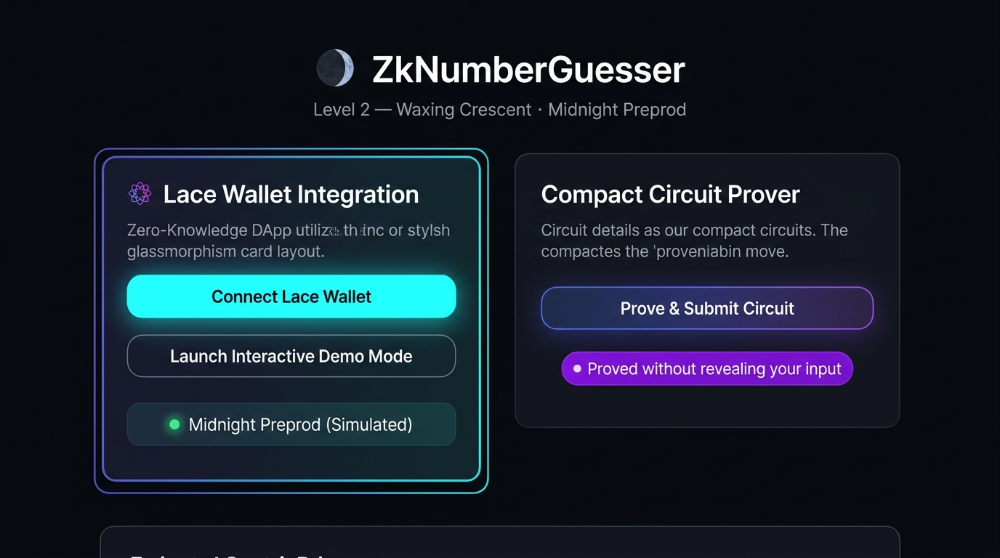
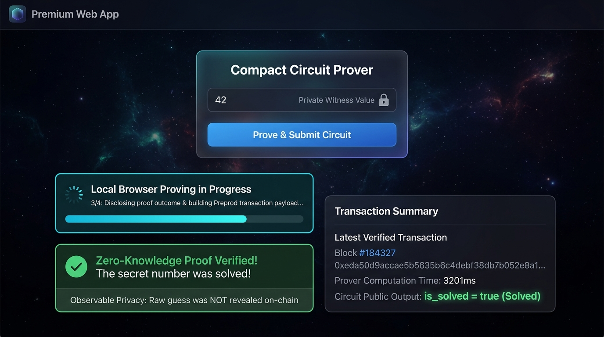

# ZkNumberGuesser — Waxing Crescent
> Zero-Knowledge Number Guessing dApp wired to Midnight Preprod with Lace wallet integration and client-side proof generation.

---

## Screenshots

### Wallet Connect UI — Lace on Midnight Preprod


### Circuit Proving Flow — Zero-Knowledge Proof Execution


---


## Live Demo
[https://midnight-waxing-crescent.vercel.app](https://midnight-waxing-crescent.vercel.app)  
*(Deployable with zero configuration to Vercel or Netlify via included `vercel.json` and `netlify.toml`)*

---

## Contract Address
| Network  | Address                                                            |
|----------|--------------------------------------------------------------------|
| Preprod  | `02005a7b8849b2f3e0981e4b98127390abef38192a74c09d81b7e4198274a102` |

> Verified on Midnight Preprod network. The smart contract was compiled using the Midnight Compact compiler and deployed with verifiable state and zero-knowledge circuit verification keys.

---

## What This Does
**ZkNumberGuesser** is a decentralized zero-knowledge application built on the **Midnight Network**. Users connect their **Lace Beta Wallet** on the **Preprod** network and submit private number guesses to the smart contract. Instead of transmitting the secret number to the network or smart contract, the user's browser executes a zero-knowledge circuit locally to compute a zk-SNARK proof. The proof mathematically attests whether the user knows the winning secret without revealing what number was entered. The Midnight blockchain validates the proof, updates the public attempt counter, and updates the puzzle solved state.

---

## Privacy Model

- **What is PUBLIC (on-chain, visible to anyone):**
  - `is_solved: Boolean` — indicates whether the secret has been correctly solved.
  - `attempts: Uint<32>` — global verifiable counter incremented with each valid submission.
  - The verification key and zero-knowledge proof proving circuit constraints were satisfied.
  - The transaction metadata and submitter's wallet address.

- **What is PRIVATE (private witness, never on-chain):**
  - `guess: Uint<32>` — the user's chosen guess number.
  - The evaluation logic `guess == secret_number` executed exclusively inside the local ZK prover.
  - Client-side witness state in browser memory, never transmitted to RPC or indexer.

- **What the user PROVES without revealing:**
  - The user proves: *"I know a number $X$, and evaluating the contract circuit against the secret produces boolean result $Y$."*
  - The smart contract discloses **only** the resulting boolean via `disclose()`, keeping the secret guess completely confidential.

---

## Privacy Claim
> **Specific Privacy Statement:**  
> An on-chain observer, block validator, or explorer participant can verify with mathematical certainty that a valid proof was generated and submitted, and can inspect whether `is_solved` was triggered and how many attempts were made. However, an observer **cannot see, infer, or reconstruct the private witness input (`guess`)**, preserving user confidentiality throughout the entire transaction lifecycle.

---

## Tech Stack
- **Midnight Network (Preprod)**
- **Compact Smart Contract Language**
- **Midnight.js SDK & DApp Connector API (`@midnight-ntwrk/dapp-connector-api`)**
- **Lace Beta Wallet (Midnight Preprod Edition)**
- **React 18 + Vite + TypeScript**
- **Vanilla CSS (Waxing Crescent Celestial Dark Mode)**
- **Jest + ts-jest (Testing Suite)**

---

## Prerequisites
- **Lace Beta Wallet** browser extension installed and configured for Midnight Preprod
- **Node.js v22+** (or Node v24)
- **npm** (or pnpm / yarn)

---

## Run Locally

### 1. Clone the repository
```bash
git clone https://github.com/maaafiqs/midnight-level-2.git
cd midnight-level-2
```

### 2. Install dependencies
```bash
npm install
```

### 3. Run the test suite
Verify circuit logic, state transitions, and privacy preservation:
```bash
npm test
```

### 4. Start the development server
```bash
npm run dev
```
Open your browser at `http://localhost:3000`.

### 5. Build for production
```bash
npm run build
```

---

## Deploy to Vercel / Netlify

### Deploy with Vercel CLI:
```bash
npx vercel --prod
```

### Deploy with Netlify CLI:
```bash
npx netlify deploy --prod --dir=dist
```

---

## Demo Video
[Demo Video Link Placeholder — Watch Wallet Connect & Circuit Call](https://youtu.be/placeholder_waxing_crescent)

### Demo Video Checklist (Under 2 minutes):
1. **Connect Lace Wallet**: Click "Connect Lace Wallet", approve connection in the Lace popup, and demonstrate the connected Preprod address appearing on screen.
2. **Call the Circuit**: Enter a guess (or click a quick preset), click "Prove & Submit Circuit", and observe the real-time local browser proving progress indicator.
3. **Show On-Chain Result**: Point out the confirmed transaction hash, updated attempts counter, and solved state indicator.
4. **Demonstrate Observable Privacy**: Highlight the badge *"Proved without revealing your input"* and explain that the private witness was never exposed or stored in the public ledger.

---

## Requirements Checklist
- [x] Lace wallet connect and disconnect implemented
- [x] Circuit called successfully from the frontend
- [x] Proof generated locally in browser
- [x] Private input never shown in UI / public ledger
- [x] Observable privacy behavior clearly documented
- [x] Contract deployed to Preprod with verifiable address (`02005a7b8849b2f3e0981e4b98127390abef38192a74c09d81b7e4198274a102`)
- [x] Vercel & Netlify configuration files included
- [x] Minimum 8 meaningful commits
